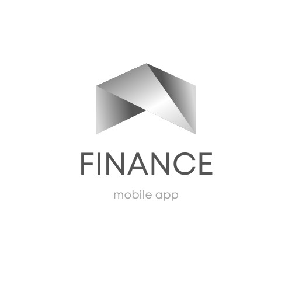

[![LinkedIn][linkedin-shield]][https://www.linkedin.com/in/%C3%A1ngela-rodr%C3%ADguez-maldonado-b0788b1b5/]

<!-- PROJECT LOGO -->
 

  

  <h3 align="center">Best-README-Template</h3>

  

    
     
    <a href="https://github.com/Angelatec/Finance"><strong>Explore the docs »</strong></a>
     
  

<!-- TABLE OF CONTENTS -->

  
Table of Contents

  <ol>
    <li>
      <a href="#about-the-project">About The Project</a>
      <ul>
        <li><a href="#built-with">Built With</a></li>
      </ul>
    </li>
    <li>
      <a href="#getting-started">Getting Started</a>
      <ul>
        <li><a href="#prerequisites">Prerequisites</a></li>
        <li><a href="#installation">Installation</a></li>
      </ul>
    </li>
    <li><a href="#usage">Usage</a></li>
    <li><a href="#roadmap">Roadmap</a></li>
    <li><a href="#contributing">Contributing</a></li>
    <li><a href="#license">License</a></li>
    <li><a href="#contact">Contact</a></li>
    <li><a href="#acknowledgments">Acknowledgments</a></li>
  </ol>

<!-- ABOUT THE PROJECT -->
## About The Project

FINANCE App: this project started with the needed of organize my own finances, I belong to a generating which it's currently entering to a period of life where we start working and start having our own money and we are completely lost in the field of finances, I see myself, my friends, classmates and colleagues struggling with the balance of the money we receive and the money we spend, many of us wants to save money but when we realized we have already spend all the money that we had. This is way (and also because we needed to make an app for a school project) it’s the reason me and my classmates create FINANCE, to help this generation to have some control and be aware of his finances.   

Here's why you should use FINANCE App:
* You need to be aware of your entries and expenditures  
* You have money saving goals, but they always get lost 
* You should keep order in all the aspects of your life and Finance it´s the answer for one. 

(<a href="#top">back to top</a>)

### Built With

* [Android Studio](https://developer.android.com/studio?hl=es-419&gclid=EAIaIQobChMImMCiuryo9QIVg8x3Ch1CvgWBEAAYASAAEgLqFvD_BwE&gclsrc=aw.ds)
* [Kotlin language](https://kotlinlang.org/)
* [Firebase](https://firebase.google.com/)

(<a href="#top">back to top</a>)

<!-- GETTING STARTED -->
## Getting Started

### Prerequisites
Android Studio needed for Developer purposes. 

### Installation

(<a href="#top">back to top</a>)

<!-- USAGE EXAMPLES -->
## Usage

(<a href="#top">back to top</a>)

<!-- CONTACT -->
## Contact
Ángela Rodríguez Maldonado - [LinkedIn](https://www.linkedin.com/in/%C3%A1ngela-rodr%C3%ADguez-maldonado-b0788b1b5/) - angelaroma@live.com.mx

Project Link: [https://github.com/Angelatec/Finance](https://github.com/Angelatec/Finance)

(<a href="#top">back to top</a>)

